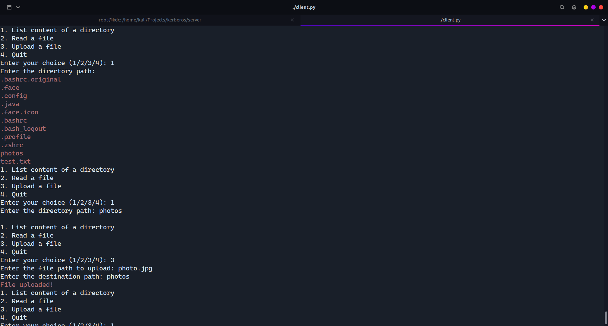

# Kerberos authenticated Flask app

## Description

This project demonstrates using kerberos to authenticate clients to access a flask
service hosted on another machine.

The Flask app allows clients from remote machines to access their corresponding
user's host directory in the machine hosting the Flask service.
For example a user name test can access through this app his corresponding test user
on the host machine, he can read the content of files, see the contents of directories and upload a file from his machine to the server machine.

The user must authenticate throught kerberos, so he must have a ticket to access the service.

## Technologies

The service is built using Flask, a framework for web development in python.

The client is built using python, as a command line program

## Configuration

We are going to use two machines, the server machine and the client machine.

The server machine holds the KDC and the flask service.

The client machine will authenticate using kerberos to access the service on the server machine.

### Kerberos Configuration

1. DNS (Domain Name Server)
   We'll add the hosts for the kdc/server and client in /etc/hosts file

```
sudo vim /etc/hosts
```

and add the following:

```
192.168.18.1	client.insat.tn client
192.168.18.128	kdc.insat.tn kdc
```

2. Time syncronization
   Check that the two machines use the same time zone, type this command on the two machines

```
timedatectl
```

3. Configure the KDC
   switch to root user

```
su root
```

3.1. install the krb5 packages

```
apt install krb5-kdc krb5-admin-server krb5-config
```

When asked, set the REALM to INSAT.TN, the kerberos server and the admin server to kdc.insat.tn

3.2. Create the principals database

```
krb5_newrealm
```

3.3. Create principals

```
kadmin.local
```

now we'll add one principal that represents the service, which is the flask app
and we'll add its key to the default keytab file /etc/kdc5.keytab so that it can be use to encrypt the message involved in the kerberos protocol

```
addprinc -randkey host/kdc.insat.tn
ktadd host/kdc.insat.tn
```

Next we'll add a principal for the user, the client that will use the app and we'll give a password

```
addprinc user
```

3.4 Restart the kerberos server

```
systemct restart krb5-admin-server
```

3.5 Add ths unix user corresponding to the user principal

```
useradd -m -s /usr/bin/bash user
```

### Server Configuration

We have to install the needed dependencies

```
pip install Flask
pip install Flask-Kerberos
```

if an error occurred run `apt install libkrb5-dev`

Clone the repo to have access to the server.py file.
we have to set the KRB5_KTNAME variable to reference the keytab file which holds the key of the service.

```
export KRB5_KTNAME=/etc/krb5.keytab
```

Next run the server.py file to launch the Flask server

```
chmod +x server/server.py
server/server.py
```

### Client Configuration

First switch the user corresponding to the principal that we're added.
If it doesn't exist you can add it

```
useradd -m -s /usr/bin/bash user
su user
```

Then Clone the repo to have access to the client.py program.

install the kerberos package

```
pip install kerberos
```

Make the client program executable

```
chmod +x client/client.py
```

Next You'll have to get the TGT (Ticket Granting Ticket) so that you can authenticate later without using a password, you'll enter the password just once to get the TGT

```
kinit
```

You can list the tickets availabe and see that you have a TGT now

```
klist
```

You can now run the program and begin interacting :)

```
client/client.py
```

## Screenshots





If we have no TGT, we can't access any route


## References

[python kerberos](http://python-notes.curiousefficiency.org/en/latest/python_kerberos.html)

[Flask kerberos](https://flask-kerberos.readthedocs.io/en/latest/)

[setting up kerberos](https://blog.magnatox.com/posts/setting_up_kerberos_ssh_on_linux/)
